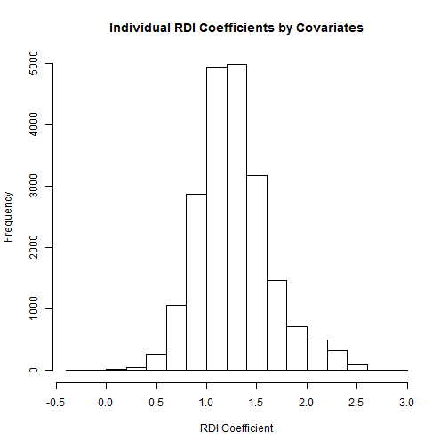
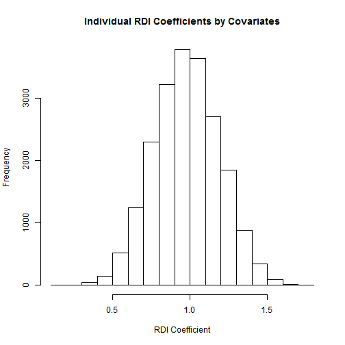

```r
library(lme4)
library(stargazer)
library(splines)
#print(load('datNonImputed.RData'))
```


```r
if(!is.element('anes',ls())){
anes <- read.table('data/anes_timeseries_cdf_rawdata.txt', sep='|',header=TRUE)
}

## keep only years of interest
anes <- anes[anes$VCF0004%in%seq(1956,2012,4),]

anes$vote <- anes$VCF0706
anes$vote[anes$vote%in%c(0,7)] <- NA

dat <- data.frame(year=anes$VCF0004)

dat$weight <- anes$VCF0009x

dat$state <- anes$VCF0901b

dat$repub <- dat$year %in% c(1956,1960,1972,1976,1984,1988,1992,2004,2008)

dat$inc <- ifelse(dat$repub,2,1)

dat$vote <- anes$vote==dat$inc


dat$vote <- rep(NA,nrow(dat))
dat$vote[dat$repub & anes$vote==2] <- 1
dat$vote[dat$repub & anes$vote==1] <- 0
dat$vote[!dat$repub & anes$vote==2] <- 0
dat$vote[!dat$repub & anes$vote==1] <- 1


dat$incumbentParty <- ifelse(dat$repub,-1,1)
dat$finances <- ifelse(anes$VCF0880==1,1,
                       ifelse(anes$VCF0880==2,0,
                              ifelse(anes$VCF0880==3,-1,NA)))
dat$finances1 <- ifelse(anes$VCF0880b==1,1,
                       ifelse(anes$VCF0880b==3,0,
                              ifelse(anes$VCF0880b==5,-1,NA)))
dat$finances[dat$year<1966] <- dat$finances1[dat$year<1966]

dat$partyID <- ifelse(anes$VCF0301==1,3,
                      ifelse(anes$VCF0301%in%c(2,3),2,
                             ifelse(anes$VCF0301%in%c(4,9),0, #Apolitical=ind??
                                    ifelse(anes$VCF0301%in%c(5,6),-2,
                                           ifelse(anes$VCF0301==7,-3,NA)))))
dat$region <- anes$VCF0112

dat$retrospective <- anes$VCF0871
dat$retrospective <- ifelse(dat$retrospective%in%c(8,9),
                            ifelse(anes$VCF0870==1, 2,
                                   ifelse(anes$VCF0870==5,4,NA)),dat$retrospective)
dat$retrospective[dat$retrospective==0] <- NA
dat$retrospective <- -(dat$retrospective-3)/2

dat$prospective <- -(anes$VCF0872-3)/2
dat$prospective[dat$prospective%in%c(-2.5,-3)] <- NA

dat$race <- as.numeric(anes$VCF0106!=1)
dat$race[anes$VCF0106==9] <- NA
dat$race6 <- factor(anes$VCF0105b)
dat$race6[dat$race6==0] <- 9
#dat$race6[dat$race6%in%c('3','4')] <- '7'


nbiRdi <- read.csv('data/NBI.RDI.csv') #this is cut and pasted from Table 1 in Nadeau Lewis-Beck.
## I'm assuming the data they put in the table is the data they used in the analysis.

dat <- merge(dat,nbiRdi,by='year',all.x=TRUE)

dat$finances1 <- NULL
dat$repub <- NULL


### add in some more variables to help with the imputation
dat$age <- anes$VCF0101
dat$age <- dat$age/sd(dat$age,na.rm=TRUE)
dat$gender <- factor(anes$VCF0104,exclude=NULL)
dat$hisp <- factor(anes$VCF0107  )
dat$hisp[dat$hisp%in%c('1','2','3','4')] <- '1'
dat$educ <- factor(anes$VCF0110,ordered=TRUE,exclude=NULL)
dat$urbanism <- factor(anes$VCF0111,exclude=NULL)
dat$marital <- anes$VCF0147
dat$marital[dat$marital==4] <- 3
dat$marital[dat$marital==7] <- 2
dat$marital[dat$marital>7] <- NA
dat$marital <- factor(dat$marital)
dat$class <- factor(anes$VCF0148,exclude=NULL)
dat$class[dat$class=='7'] <- '9'


yearExt=c(2000,2004,2008,2012)
rdiDat <- read.csv('data/RDI.csv',na.st='.',stringsAsFactors=FALSE)
# downloaded from FRED http://research.stlouisfed.org/fred2/series/A229RX0/downloaddata 5/27/14


nbiDat <- read.csv('data/NBIquarterly.csv',skip=1)
# downloaded from http://www.sca.isr.umich.edu/data-archive/mine.php 'Table 25: Current Business Conditions Compared with a Year Ago' 5/27/14
nbiDat$index <- nbiDat[,'Better.Now']-nbiDat[,'Worse.Now']


nbiYear <- function(year){

    row <- function(quarter)
        which(nbiDat$Year==year & nbiDat$Quarter==quarter)

    nbiDat$index[row(4)]
}

nbiRdiExtend <- cbind(
    year=yearExt,
    NBI=sapply(yearExt, nbiYear),

    RDI=sapply(yearExt,function(year)
        rdiDat[rdiDat$DATE==paste(year,'-11-01',sep=''),'VALUE'])
)

for(y in c(2000,2004,2008,2012)){
    row <- nbiRdiExtend[nbiRdiExtend[,'year']==y,]
    dat$NBI[dat$year==y] <- row['NBI']
    dat$RDI[dat$year==y] <- row['RDI']
}
```

## Models reported in paper


```r
rf <- glmer(vote~RDI+finances+incumbentParty+incumbentParty:race+incumbentParty:partyID+(1|year)+(1|state),
            data=dat,family=binomial(logit),weights=weight)
ret <- update(rf,.~.+retrospective)
pro <- update(rf,.~.+prospective)
both <- update(rf,.~.+retrospective+prospective)
```


```r
stargazer(rf,ret,pro,both,type='html',star.cutoffs=c(0.05,0.01,0.001),
          notes=' <sup> * </sup>p<0.05; <sup> ** </sup>p<0.01; <sup> *** </sup>p<0.001',notes.append=FALSE)
```


<table style="text-align:center"><tr><td colspan="5" style="border-bottom: 1px solid black"></td></tr><tr><td style="text-align:left"></td><td colspan="4"><em>Dependent variable:</em></td></tr>
<tr><td></td><td colspan="4" style="border-bottom: 1px solid black"></td></tr>
<tr><td style="text-align:left"></td><td colspan="4">vote</td></tr>
<tr><td style="text-align:left"></td><td>(1)</td><td>(2)</td><td>(3)</td><td>(4)</td></tr>
<tr><td colspan="5" style="border-bottom: 1px solid black"></td></tr><tr><td style="text-align:left">RDI</td><td>0.207<sup>***</sup></td><td>0.025</td><td>0.200<sup>***</sup></td><td>0.028</td></tr>
<tr><td style="text-align:left"></td><td>(0.060)</td><td>(0.053)</td><td>(0.057)</td><td>(0.057)</td></tr>
<tr><td style="text-align:left"></td><td></td><td></td><td></td><td></td></tr>
<tr><td style="text-align:left">finances</td><td>0.305<sup>***</sup></td><td>0.180<sup>***</sup></td><td>0.316<sup>***</sup></td><td>0.185<sup>***</sup></td></tr>
<tr><td style="text-align:left"></td><td>(0.030)</td><td>(0.041)</td><td>(0.042)</td><td>(0.044)</td></tr>
<tr><td style="text-align:left"></td><td></td><td></td><td></td><td></td></tr>
<tr><td style="text-align:left">incumbentParty</td><td>-0.490<sup>***</sup></td><td>-0.466<sup>***</sup></td><td>-0.325<sup>***</sup></td><td>-0.454<sup>***</sup></td></tr>
<tr><td style="text-align:left"></td><td>(0.102)</td><td>(0.087)</td><td>(0.094)</td><td>(0.093)</td></tr>
<tr><td style="text-align:left"></td><td></td><td></td><td></td><td></td></tr>
<tr><td style="text-align:left">retrospective</td><td></td><td>1.126<sup>***</sup></td><td></td><td>1.066<sup>***</sup></td></tr>
<tr><td style="text-align:left"></td><td></td><td>(0.075)</td><td></td><td>(0.080)</td></tr>
<tr><td style="text-align:left"></td><td></td><td></td><td></td><td></td></tr>
<tr><td style="text-align:left">prospective</td><td></td><td></td><td>0.435<sup>***</sup></td><td>0.293<sup>***</sup></td></tr>
<tr><td style="text-align:left"></td><td></td><td></td><td>(0.050)</td><td>(0.052)</td></tr>
<tr><td style="text-align:left"></td><td></td><td></td><td></td><td></td></tr>
<tr><td style="text-align:left">incumbentParty:race</td><td>1.188<sup>***</sup></td><td>1.082<sup>***</sup></td><td>1.056<sup>***</sup></td><td>1.045<sup>***</sup></td></tr>
<tr><td style="text-align:left"></td><td>(0.075)</td><td>(0.091)</td><td>(0.094)</td><td>(0.096)</td></tr>
<tr><td style="text-align:left"></td><td></td><td></td><td></td><td></td></tr>
<tr><td style="text-align:left">incumbentParty:partyID</td><td>0.854<sup>***</sup></td><td>0.882<sup>***</sup></td><td>0.888<sup>***</sup></td><td>0.865<sup>***</sup></td></tr>
<tr><td style="text-align:left"></td><td>(0.012)</td><td>(0.016)</td><td>(0.017)</td><td>(0.017)</td></tr>
<tr><td style="text-align:left"></td><td></td><td></td><td></td><td></td></tr>
<tr><td style="text-align:left">Constant</td><td>-0.355<sup>*</sup></td><td>0.169</td><td>-0.436<sup>**</sup></td><td>0.142</td></tr>
<tr><td style="text-align:left"></td><td>(0.179)</td><td>(0.141)</td><td>(0.148)</td><td>(0.150)</td></tr>
<tr><td style="text-align:left"></td><td></td><td></td><td></td><td></td></tr>
<tr><td colspan="5" style="border-bottom: 1px solid black"></td></tr><tr><td style="text-align:left">Observations</td><td>19,358</td><td>13,190</td><td>12,040</td><td>11,977</td></tr>
<tr><td style="text-align:left">Log Likelihood</td><td>-6,223.000</td><td>-3,189.000</td><td>-2,944.000</td><td>-2,835.000</td></tr>
<tr><td style="text-align:left">Akaike Inf. Crit.</td><td>12,462.000</td><td>6,397.000</td><td>5,907.000</td><td>5,690.000</td></tr>
<tr><td style="text-align:left">Bayesian Inf. Crit.</td><td>12,525.000</td><td>6,464.000</td><td>5,973.000</td><td>5,763.000</td></tr>
<tr><td colspan="5" style="border-bottom: 1px solid black"></td></tr><tr><td style="text-align:left"><em>Note:</em></td><td colspan="4" style="text-align:right"><sup> * </sup>p<0.05; <sup> ** </sup>p<0.01; <sup> *** </sup>p<0.001</td></tr>
</table>

## Are there any "anti-RDI" sub-populations?


```r
dat <- within(dat,{
    financesFac <- factor(finances,exclude=NULL)
    partyIDFac <- factor(partyID,exclude=NULL)})
fullInteraction <- glmer(vote~RDI*(financesFac+partyIDFac+
                                   race6+age+class+educ+gender+marital+urbanism)+
                             incumbentParty*(race6+partyID)+
                             (RDI|state)+(1|year),data=dat,family=binomial(logit))


slopes <- fixef(fullInteraction)
slopes <- slopes[grep('RDI',names(slopes))]
slopes[-1] <- slopes[-1]+slopes['RDI']

### for whom is the coefficient on RDI negative?
terms <- names(fixef(fullInteraction))
intTerms <- terms[grep('RDI:',terms)]
intWith <- gsub('RDI:','',intTerms)

RDIslope <- slopes['RDI']+model.matrix(fullInteraction)[,intWith]%*%slopes[intTerms]+
    ranef(fullInteraction)$state[as.character(fullInteraction@frame$state),'RDI']
hist(RDIslope,main='Individual RDI Coefficients by Covariates',xlab='RDI Coefficient')
```



## Are there any sub-populations that can't judge RDI?


```r
fullInteractionRet <- lmer(retrospective~RDI*(financesFac+partyIDFac+
                                   race6+age+class+educ+gender+marital+urbanism)+
                             incumbentParty*(race6+partyID)+
                             (RDI|state)+(1|year),data=dat)

slopes <- fixef(fullInteractionRet)
slopes <- slopes[grep('RDI',names(slopes))]
slopes[-1] <- slopes[-1]+slopes['RDI']

### for whom is the coefficient on RDI negative?
terms <- names(fixef(fullInteractionRet))
intTerms <- terms[grep('RDI:',terms)]
intWith <- gsub('RDI:','',intTerms)

RDIslope <- slopes['RDI']+model.matrix(fullInteractionRet)[,intWith]%*%slopes[intTerms]+
        ranef(fullInteractionRet)$state[as.character(fullInteractionRet@frame$state),'RDI']
hist(RDIslope,main='Individual RDI Coefficients by Covariates',xlab='RDI Coefficient')
```



## Which presidential popular votes would flip...
### ... were RDI at its mean value?

```r
## state-by-state too hard; look at popular vote
pop <- read.csv('data/popularVote.csv',header = TRUE)[1:15,]

### what if each year RDI had been at its mean?
ddd <- rf@frame
meanRDI <- mean(aggregate(ddd$RDI,list(year=ddd$year),mean)$x)
factual <- predict(rf)
counterfactual <- factual-fixef(rf)['RDI']*(ddd$RDI-meanRDI)
predPropFac <- aggregate(plogis(factual),by=list(year=ddd$year),mean)
predPropCouFac <- aggregate(plogis(counterfactual),by=list(year=ddd$year),mean)
pop$diff <- 100*(predPropCouFac$x-predPropFac$x)

print(with(pop,year[(-1)^(incWin)*diff> Margin/2]))
```

```
## [1] 1960 1980
```

### ... were RDI to shift by 1 SD? (in the "wrong" direction)


```r
rdisd <- sd(vapply(unique(dat$year),function(y) mean(dat$RDI[dat$year==y]),1))

pop$logodds <- log((pop$incVote/100)/(1-pop$incVote/100))
pop$counter <- ilogit(pop$logodds+(-1)^(pop$incWin)*fixef(rf)['RDI'])


print(pop$year[abs(pop$incVote/100-pop$counter)>pop$Margin/200])
```

```
##  [1] 1960 1968 1976 1980 1988 1992 1996 2000 2004 2008 2012
```


### ... were retro at its mean value?

```r
pop2 <- subset(pop,year>1979)
ddd <- ret@frame
meanRET <- mean(aggregate(ddd$retrospective,list(year=ddd$year),mean)$x)
factual <- predict(ret)
counterfactual <- factual-fixef(ret)['retrospective']*(ddd$retrospective-meanRET)
predPropFac <- aggregate(plogis(factual),by=list(year=ddd$year),mean)
predPropCouFac <- aggregate(plogis(counterfactual),by=list(year=ddd$year),mean)
pop2$diff <- 100*(predPropCouFac$x-predPropFac$x)

print(with(pop2,year[(-1)^(incWin)*diff> Margin/2]))
```

```
## [1] 1980 1992 2008
```

### ... were retro to shift by 1 SD? (in the "wrong" direction)


```r
retsd <- sd(vapply(unique(ddd$year),function(y) mean(ddd$retrospective[ddd$year==y]),1))
ilogit <- function(x) exp(x)/(1+exp(x))

pop2$logodds <- log((pop2$incVote/100)/(1-pop2$incVote/100))
pop2$counter <- ilogit(pop2$logodds+(-1)^(pop2$incWin)*fixef(ret)['retrospective'])


print(pop2$year[abs(pop2$incVote/100-pop2$counter)>pop2$Margin/200])
```

```
## [1] 1980 1984 1988 1992 1996 2000 2004 2008 2012
```


## upper bound on proportion anti-growth


```r
n <- with(dat,sum(!is.na(RDI) & !is.na(retrospective) & RDI<1.7))
succsesses <- with(dat,sum(!is.na(RDI) & !is.na(retrospective) & RDI<1.7& retrospective==1))
print(binom.test(61,5089,alternative='less',conf.level=0.95))
```

```
## 
## 	Exact binomial test
## 
## data:  61 and 5089
## number of successes = 61, number of trials = 5100, p-value
## <0.0000000000000002
## alternative hypothesis: true probability of success is less than 0.5
## 95 percent confidence interval:
##  0.00000 0.01481
## sample estimates:
## probability of success 
##                0.01199
```

```r
print(binom.test(61,5089,alternative='less',conf.level=0.99))
```

```
## 
## 	Exact binomial test
## 
## data:  61 and 5089
## number of successes = 61, number of trials = 5100, p-value
## <0.0000000000000002
## alternative hypothesis: true probability of success is less than 0.5
## 99 percent confidence interval:
##  0.00000 0.01604
## sample estimates:
## probability of success 
##                0.01199
```

```r
print(binom.test(61,5089,alternative='less',conf.level=0.999))
```

```
## 
## 	Exact binomial test
## 
## data:  61 and 5089
## number of successes = 61, number of trials = 5100, p-value
## <0.0000000000000002
## alternative hypothesis: true probability of success is less than 0.5
## 99.9 percent confidence interval:
##  0.00000 0.01748
## sample estimates:
## probability of success 
##                0.01199
```


